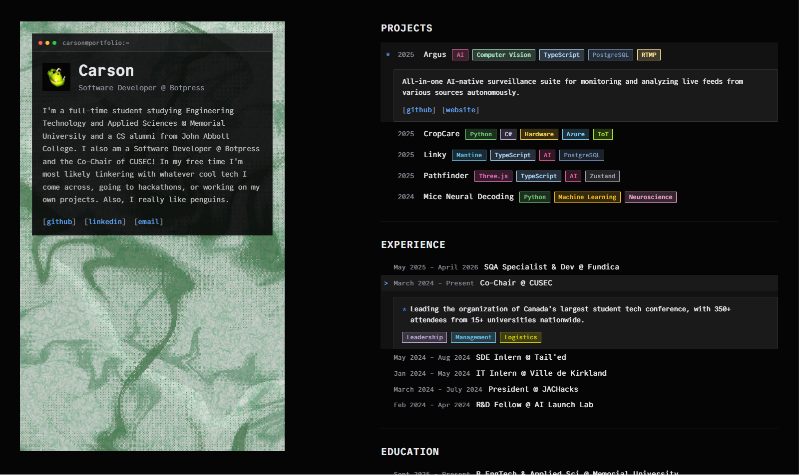

# 🎨 Carson's Portfolio

**A showcase of my journey, projects, and passion for Computer Science.**

---

### ✨ Crafted With

## 🚀 About

Welcome to my personal corner of the web! This portfolio is designed to be a reflection of my work and my growth as a developer. It features smooth animations, a responsive design, and accessible interfaces.

## 🔗 Resources & Standards

I believe in documenting the process and maintaining high standards. Here are some resources that guide my development:

- 📚 **[Next.js Documentation](https://nextjs.org/docs)** - The framework used for this portfolio.
- 🔍 **[Conventional Commits](https://www.conventionalcommits.org/)** - My guide for clean and meaningful commit messages.

## 📬 Connect

Interested in my work or just want to say hi?

> [!NOTE]
> Feel free to reach out if you have questions about my projects or process!

**Thanks for stopping by!** 🎉
