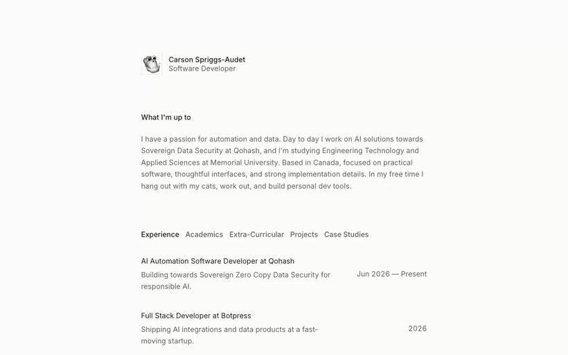

<!-- <CENTERED SECTION FOR GITHUB DISPLAY> -->

<div align="center">

# carsonspriggs.me

**Typography-led portfolio. No frameworks I don't need, no bloat I can't justify.**

[](https://carsonspriggs.me)

[](https://nextjs.org/)
[](https://react.dev/)
[](https://www.typescriptlang.org/)
[](https://biomejs.dev/)
[](./LICENSE)

[**Visit the site →**](https://carsonspriggs.me)

</div>

<!-- </CENTERED SECTION FOR GITHUB DISPLAY> -->

---

## The point

Most developer portfolios are a scroll-jacking parallax hero, six animation libraries, and a 4 MB payload to say what a paragraph could.

This one is a column of text. Recruiters scan it in twenty seconds; anyone who wants depth can click into a case study. Every element that didn't earn its place is gone.

## Highlights

| | Thing | What it actually means |
| :---: | :--- | :--- |
| 📐 | **Typography-led** | A single 644px column, one variable font, spacing on a fixed step scale. Hierarchy comes from type, not chrome. |
| ⚡ | **Fully static** | `output: "export"` — pre-rendered HTML, no server, no runtime data fetching. |
| 🔤 | **One self-hosted font** | Inter subset to Latin, preloaded, under a private family name so a locally installed Inter can't paint first and reflow. |
| 🗂️ | **Typed content** | Experience and projects are typed from Zod schemas; case studies are typed data, not MDX. |
| 🔍 | **SEO that resolves** | Generated sitemap and robots, JSON-LD `Person` + `WebSite` + `Article`, absolute canonical and `og:image` URLs. |
| ♿ | **Keyboard-complete** | Roving-tabindex tab list, skip link, visible focus rings, screen-reader labels on every external link. |
| 🖼️ | **Images that behave** | WebP throughout; every image in `public/` adds up to 428 KB. |
| 🔒 | **Real headers** | CSP, HSTS, `X-Frame-Options`, and immutable asset caching via `vercel.json`. |
| 🧹 | **Dead code fails CI** | Biome, `tsc --noEmit`, knip, and the build all gate every push. |

## Stack

Next.js 16 App Router · React 19 · TypeScript (strict) · Sass · Zod · Biome · knip · pnpm

No Tailwind. No CSS-in-JS. No animation library. The interactions that exist are CSS.

## Structure

```
app/
├── components/     Identity, About, Directory, Contact
├── case-studies/   index + [slug] route
├── data/           experiences, projects, caseStudies
├── lib/seo.ts      one source of truth for metadata
├── robots.ts       generated, not static
└── sitemap.ts      generated from case-study dates
public/             fonts, WebP images, social card
```

Content lives in `app/data/`. Adding a case study means adding an object — the index page, the sitemap, and the JSON-LD all follow from it.

## Running it

```bash
pnpm install
pnpm dev            # localhost:3000
```

| Task | Command |
| :--- | :--- |
| Build (static export to `./out`) | `pnpm build` |
| Preview the built output | `pnpm start` |
| Lint + format check | `pnpm lint` |
| Typecheck | `pnpm typecheck` |
| Find dead code | `pnpm lint:unused` |

> [!NOTE]
> The social card is drawn in `public/social-card.svg` and shipped as PNG, because Twitter, LinkedIn, and Slack all ignore SVG. After editing the SVG:
>
> ```bash
> rsvg-convert -w 1200 -h 630 public/social-card.svg -o public/social-card.png
> ```

## Case studies

Longer write-ups on things I've built, framed around the decisions rather than the feature list.

- [**Working at Botpress**](https://carsonspriggs.me/case-studies/botpress) — shipping and ownership at an AI startup
- [**Argus**](https://carsonspriggs.me/case-studies/argus) — live video review tooling · 2x hackathon winner
- [**Linky**](https://carsonspriggs.me/case-studies/linky) — a URL into a retrieval-backed knowledge base
- [**CropCare**](https://carsonspriggs.me/case-studies/cropcare) — sensors, MQTT, and Azure into one field workflow

## Connect

- Email — [carsonspriggs8@gmail.com](mailto:carsonspriggs8@gmail.com)
- LinkedIn — [carsonspriggs](https://www.linkedin.com/in/carsonspriggs)
- GitHub — [carsonSgit](https://github.com/carsonSgit)

> [!TIP]
> Fork it if it's useful. If you ship something with it, I'd genuinely like to see it.

<div align="center">

<sub>MIT · built in the open</sub>

</div>
